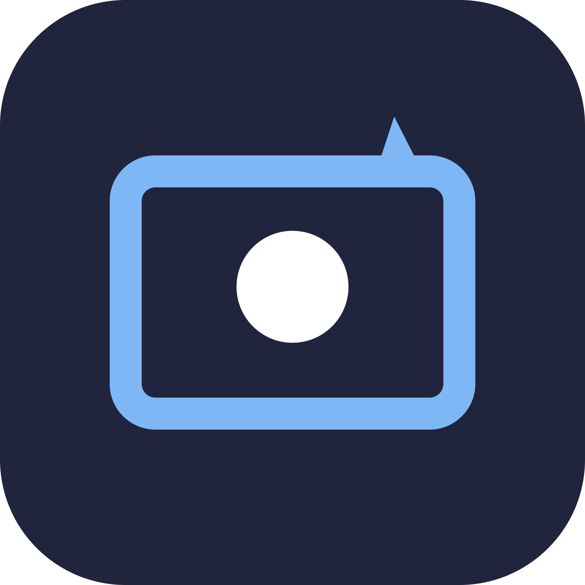

<p align="center">
  
</p>

<h1 align="center">MyScreenShort</h1>

<p align="center">
  메뉴·콤보박스·팝업이 열린 순간을 보존해 캡처하고, 주석과 예약 영역 캡처를 제공하는 macOS 메뉴 막대 앱
</p>

<p align="center">
  <a href="https://github.com/itsent-lab/MyScreenShort/actions/workflows/build.yml"></a>
  
  <a href="LICENSE"></a>
</p>

> **Beta:** 개인용 유틸리티에서 시작한 초기 공개 버전입니다. 중요한 화면을 캡처하기 전 결과를 확인해 주세요.

## 주요 기능

- `Command + Shift + S`, `Control + Shift + S` 전역 단축키
- 단축키를 누른 순간의 화면을 고정한 뒤 전체 화면 또는 영역 선택
- 열린 메뉴, 콤보박스, 팝업과 선택 상태 보존
- 펜, 화살표, 사각형, 텍스트, 지우개 주석
- 실행 취소, 다시 실행, 표시 전체 지우기
- 3초·5초·10초 예약 영역 캡처
- 마지막 예약 영역 재사용과 클릭 통과 카운트다운 테두리
- 파일 저장, 클립보드 복사 또는 동시 출력
- 저장 폴더, 표시 색상·굵기와 출력 방식 기억
- 다중 모니터와 Retina 배율 지원
- 메뉴 막대에서 선택적으로 자동 시작 설정

## 요구 사항

- macOS 13 Ventura 이상
- Swift 5.9 이상
- 화면 캡처를 위한 macOS 화면 기록 권한

## 소스에서 설치

```bash
git clone https://github.com/itsent-lab/MyScreenShort.git
cd MyScreenShort
Scripts/build-app.sh
cp -R dist/MyScreenShort-Mac.app /Applications/
open /Applications/MyScreenShort-Mac.app
```

앱 번들은 `dist/MyScreenShort-Mac.app`에 생성됩니다. 공개 Beta는 소스 빌드를 기준으로 하며, 빌드 스크립트는 로컬 테스트를 위한 ad-hoc 서명을 적용합니다.

## 사용법

### 즉시 캡처

1. `Command + Shift + S` 또는 `Control + Shift + S`를 누릅니다.
2. 전체 화면 또는 영역 선택 모드를 고릅니다.
3. 필요하면 표시 도구를 사용합니다.
4. `캡처`를 누르거나 Enter를 입력합니다. Esc는 취소입니다.

| 도구 | 단축키 | 설명 |
| --- | --- | --- |
| 펜 | `P` | 자유롭게 그리기 |
| 화살표 | `A` | 방향 강조 |
| 사각형 | `R` | 영역 강조 |
| 텍스트 | `T` | 설명 입력 |
| 지우개 | `E` | 표시 삭제 |
| 실행 취소 | `Command + Z` | 이전 표시 복원 |
| 다시 실행 | `Shift + Command + Z` | 취소한 표시 재적용 |

### 예약 영역 캡처

1. 메뉴 막대의 카메라 아이콘을 클릭합니다.
2. `영역 지정 후 예약 캡처…`를 선택합니다.
3. 하단 패널에서 영역과 `3초 / 5초 / 10초` 준비 시간을 함께 선택합니다.
4. `예약 시작`을 누르고 대상 앱에서 메뉴·콤보박스·팝업을 엽니다.
5. 클릭을 통과하는 테두리가 사라진 뒤 현재 화면이 자동으로 캡처됩니다.

`마지막 영역 다시 예약 캡처` 하위 메뉴에서 이전 영역을 바로 재사용할 수 있습니다.

## 권한과 자동 시작

처음 캡처할 때 macOS가 화면 기록 권한을 요청합니다. 권한을 변경한 뒤에는 앱을 다시 실행해야 할 수 있습니다.

자동 시작은 기본적으로 꺼져 있습니다. 필요한 경우 메뉴 막대에서 `Mac 시작 시 자동 실행`을 직접 켜세요.

## 빌드

실행 파일만 빌드하려면:

```bash
swift build -c release
```

앱 번들까지 만들려면:

```bash
Scripts/build-app.sh
```

## 개인정보 보호

캡처와 이미지 처리는 Mac 안에서 수행되며 네트워크 전송, 광고 SDK, 분석 또는 원격 측정 기능이 없습니다. 자세한 내용은 [PRIVACY.md](PRIVACY.md)를 참고하세요.

## 기여

버그 제보와 개선 제안을 환영합니다. 자세한 내용은 [CONTRIBUTING.md](CONTRIBUTING.md)를 참고하세요.

## 라이선스

[MIT License](LICENSE)

---

**English:** MyScreenShort is a macOS menu bar screenshot utility with frozen-state capture, annotations, scheduled region capture, clipboard/file output, and multi-display support.
